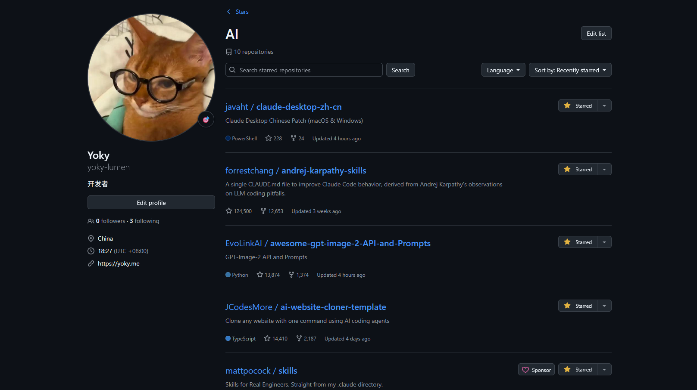
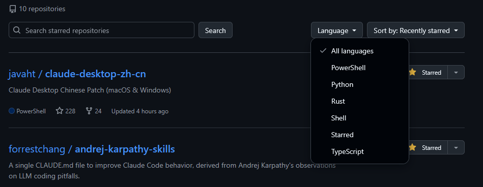

# GitHub Star Lists Enhancer

> 给 GitHub Star Lists 增加“像产品一样好用”的筛选与排序体验。  
> 一键搜索、按语言过滤、按星标/活跃度排序，帮你快速从收藏里找到真正想看的仓库。

---

## 📸 效果预览（占位图）

> 下面是仓库内置占位图（已加进项目，后续可直接替换为真实截图/GIF）。

---

## ✨ 核心功能

- 🔎 **关键字搜索**：在当前 Star List 内快速定位仓库。
- 🧩 **语言过滤**：按 `JavaScript` / `TypeScript` / `Python` 等语言筛选。
- ⏱️ **本地排序**：支持以下排序方式：
  - Recently starred
  - Recently active
  - Most stars
- ⚡ **无额外请求**：优先基于页面已有信息进行本地处理，响应更快。
- 🧭 **自动适配**：匹配 `https://github.com/stars/*/lists/*` 页面结构并注入工具栏。

---

## 🧱 适用场景

- 你的 Star 仓库很多，翻找成本高。
- 想定期整理“学习清单 / 工具清单 / 待研究项目”。
- 想快速对比同类项目热度与活跃度。

---

## 🚀 安装

### 1) 安装用户脚本管理器

任选其一：

- [Tampermonkey](https://www.tampermonkey.net/)
- [Violentmonkey](https://violentmonkey.github.io/)

### 2) 安装本脚本

- 打开仓库中的 [`github-star-lists-enhancer.user.js`](./github-star-lists-enhancer.user.js)
- 由脚本管理器确认安装

---

## 🛠 使用方法

1. 打开任意 GitHub Star List 页面：

   `https://github.com/stars/<user>/lists/<list-name>`

2. 页面加载后，仓库列表上方会自动出现增强工具栏。
3. 使用搜索框、语言下拉和排序选项进行筛选。

---

## 📦 项目结构

- `github-star-lists-enhancer.user.js`：主脚本文件
- `README.md`：项目说明文档
- `LICENSE`：开源许可证（MIT）

---

## ⚙️ 发布前建议修改

请将脚本头部中的占位信息替换为你自己的：

- `YOUR_GITHUB_USERNAME`
- `YOUR_NAME`

同时建议将 `LICENSE` 中的版权名字改为你的名称。

---

## 🗺️ Roadmap（可选）

- [ ] 支持多语言联合筛选
- [ ] 支持“仅看近 X 个月有更新”的过滤项
- [ ] 增加导出（CSV/Markdown）能力
- [ ] 提供可选深浅色样式配置

---

## 🤝 贡献

欢迎提 Issue / PR：

- Bug 反馈：页面结构变更、筛选异常、排序不准确
- 功能建议：你在管理 Star List 时最需要的能力

---

## 📄 License

[MIT](./LICENSE)
