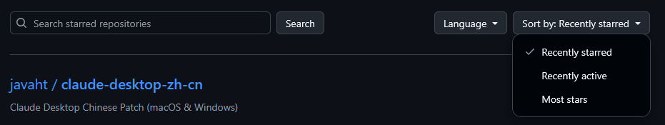

# GitHub Star Lists Enhancer

## 项目介绍

这是一个 GitHub 增强插件，起因是在star list 没有筛选栏，不便于我这样喜欢使用 list 管理的用户找查找仓库，于是便使用 AI 辅助帮我挫了一个筛选栏，现与大家分享，希望能帮到你。

## 适用场景

- 你的 Star 仓库很多，翻找成本高。
- 想定期整理“学习清单 / 工具清单 / 待研究项目”。
- 想快速对比同类项目热度与活跃度。

## 安装

安装用户脚本管理器

| **浏览器类型**                     | **支持的脚本管理器** |
| ------------------------------ | -------------- |
| Chrome / Chromium 内核         | Tampermonkey   |
| Firefox / Gecko 内核           | Tampermonkey   |

## ✨核心功能

- 🔎**关键字搜索**：在当前 Star List 内快速定位仓库。

- 🧩**语言过滤**：按 `JavaScript` / `TypeScript` / `Python` 等语言筛选。

- ⏱️

  本地排序

  ：支持以下排序方式：

  - Recently starred（默认）
  - Recently active
  - Most stars

- ⚡**无额外请求**：优先基于页面已有信息进行本地处理，响应更快。

- 🧭**自动适配**：匹配 `https://github.com/stars/*/lists/*` 页面结构并注入工具栏。

## 📸效果预览

在 star list 界面增加一个筛选栏，支持模糊搜索，筛选语言、按星标排序操作。

## 📈 项目统计

<a href="https://www.star-history.com/?type=timeline&repos=yoky-lumen/github-star-lists-enhancer">
 <picture>
   <source media="(prefers-color-scheme: dark)" srcset="https://api.star-history.com/chart?repos=yoky-lumen/github-star-lists-enhancer&type=timeline&theme=dark&legend=top-left" />
   <source media="(prefers-color-scheme: light)" srcset="https://api.star-history.com/chart?repos=yoky-lumen/github-star-lists-enhancer&type=timeline&legend=top-left" />
   
 </picture>
</a>

## 贡献

欢迎提 Issue / PR：

- Bug 反馈：页面结构变更、筛选异常、排序不准确
- 功能建议：你在管理 Star List 时最需要的能力

## 欢迎打赏

| 微信赞赏                                                     | 支付宝赞赏                                                   |
| ------------------------------------------------------------ | ------------------------------------------------------------ |
|  <small>☕喝点咖啡继续干☕</small> |  <small>🌶️来包辣条吧~🍪</small> |
